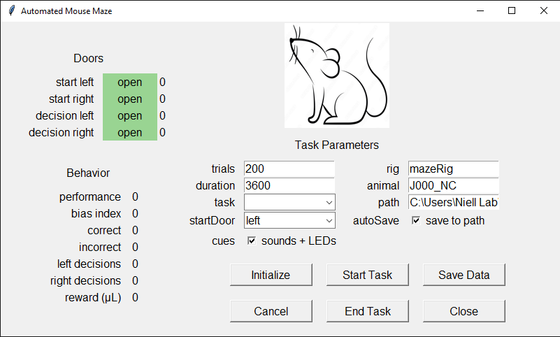
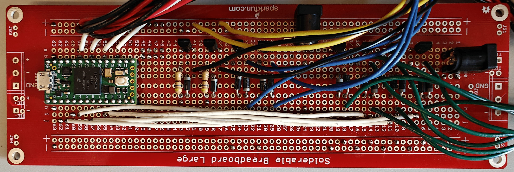
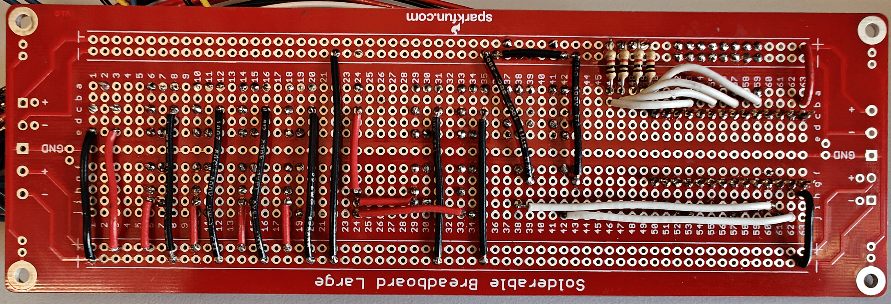
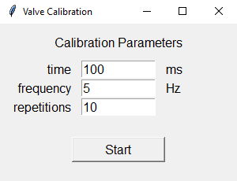
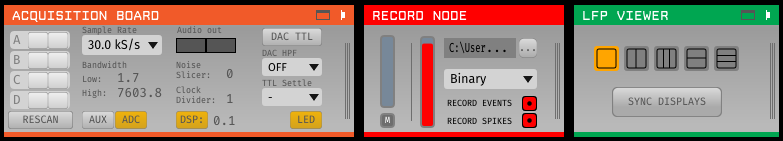

# Automated Mouse Maze

GUI for behavioral and neurophysiological experiments in an automated maze for mice.  
Currently under development in the [Niell Lab](https://nielllab.uoregon.edu/).

***Disclamimer: the initial designs for this automated maze are based on previous work done at the [Sylwestrak Lab](https://www.sylwestraklab.com/)***

# Installation

## Requirements

1. Operating System: Windows.
2. [Anaconda](https://www.anaconda.com/).
3. [Microsoft Visual C++ 14.0](https://visualstudio.microsoft.com/visual-cpp-build-tools/) or greater.
4. [Arduino IDE](https://www.arduino.cc/en/software/).
5. [StreamCatcherPro](https://www.startech.com/en-us/audio-video-products/usb3hdcap).
6. [Open Ephys GUI](https://open-ephys.org/gui)

## Step by step

In the Command Prompt:
1. Create your environment. Example:  
``conda create -n automatedMouseMaze python=3.10.14 pip``
2. Activate your environment:  
``conda activate automatedMouseMaze``
3. Choose a location where you would like to copy this repo. Example:  
``mkdir Documents\automatedMouseMaze\Application``  
``cd Documents\automatedMouseMaze\Application\``
4. Clone this repository:  
``git clone https://github.com/luismfranco/automatedMouseMaze.git .``
5. Install dependencies in your environment:  
``pip install .``
6. This code was developed for Python - Teensy 4.0 communication. pyfirmata was developed for Arduino. There is bug in pyfirmata when trying to input the Teensy 4.0 layout. To fix it, run:  
``python src\debugPyFirmata.py``

If everything went well, you should be able to run the GUI:  
``python automatedMouseMaze.py``

However, this app requires a connection with a Teensy board in order to work. Also, the automated maze has several other components, such as IR sensors, solenoid valves, a speaker, and LEDs. To build your own maze, follow this tutorial: 
[maze construction](docs/howToBuildYourOwnMaze.md).

This apps also controls and triggers the recording of video, IMU sensors, and electrophysiology probes. Please refer to [Parker et al., 2022](https://doi.org/10.1016/j.neuron.2022.08.029) for more details on this.

# Configuration Settings

Before running your first experiment, make sure you have uploaded the [Standard Firmata](https://github.com/firmata/arduino/blob/main/examples/StandardFirmata/StandardFirmata.ino) sketch into your Teensy board, which you can find in Arduino IDE at:  
``File --> Examples --> Firmata --> Standard Firmata``

Also, ensure Teensy is properly [configured](config/package.json):
1. Under ``teensyConfiguration``, select the correct serial ``port`` for communication between the computer and Teensy (e.g. ***COM3***).
2. Under ``stimulusScreen``, select the correct ``screenNumber``. In Windows, you can verify the screen number in: ``Display settings > Display > Identify``.
3. There are also a number of input and output digintal pins under ``teensyConfiguration``. Make sure they are properly assigned according to your electronic circuit (see example below).

## Example board with connections for Teensy pins

1. Solenoid valves, including transistors and diodes. The solenoids for the maze doors (green wires) require a 24 V power supply. The solenoids for the water rewards (blue wires) require a 12 V power supply. **Important: use diodes to make sure current doesn't flow back from solenoids to Teensy**. In this example, the configuration is:  
   ``"leftStartDoor": "5"``  
   ``"rightStartDoor": "7"``  
   ``"leftDecisionDoor": "9"``  
   ``"rightDecisionDoor": "11"``  
   ``"leftWaterPort": "1"``  
   ``"rightWaterPort": "3"``  
2. IR sensors, including a connection between their white signal wire and the 5V power supply (see the bottom view of the circuit below). In this example, the configuration is:  
   ``"leftStartIRsensor": "22"``  
   ``"rightStartIRsensor": "20"``  
   ``"leftDecisionIRsensor": "18"``  
   ``"rightDecisionIRsensor": "16"``  
   ``"startStimulusIRsensor": "15"``  
   ``"stopStimulusIRsensor": "14"``  
3. LEDs, including transitors diodes and resistors. LEDs require a 5 V power supply. In this example, the configuration is:  
   ``"leftLED": "0"``  
   ``"rightLED": "2"``  

# How to Run this App

In the Command Prompt, activate your environment. Example:  
``conda activate automatedMouseMaze``  
Then, cd to the location where this app was installed, and then type:  
``python automatedMouseMaze.py``

You could also create a batch file. Example:  
``call activate automatedMouseMaze``  
``cd C:\Users\Niell Lab\Documents\automatedMouseMaze\Application\``  
``python automatedMouseMaze.py``  

# Before Running an Experiment

Under ``task``, please select ``valveCalibration`` and click on ``Initialize Task``. This will open a small window with three parameters:

1. ``time`` for the opening water valves (in ms).
2. ``frequency`` for valve openning repetitions (in Hz). Make sure ``frequency`` is slow enough to allow the full openning ``time`` in each repetition.
3. Number of ``repetitions``. The shorter the ``time`` the more ``repetitions`` are needed to minimize measurement errors.

Example parameters for a calibration curve are displayed in the terminal every time ``valveCalibration`` is initialized:  
``Time:           5,  10,  15,  20,  25,  30,  40,  50,  60,  80, 100``  
``Frequency:     25,  25,  20,  15,  15,  15,  10,  10,   5,   5,   5``  
``Repetitions: 1500, 750, 500, 400, 300, 250, 200, 150, 125, 100,  50``  

Once you have calculated the correct valve opening time for 5, 6, 7, 8, 9 and 10 μL, you can update the ``src/mazeGUI.py`` script in the "Reward" subsection of the ``__init__`` method in the  ``class mazeGUI``:  
``self.estimatedReward = 0``  
``self.leftRewardStreak = [32, 36, 41, 45, 49, 54] # in ms``  
``self.rightRewardStreak = [32, 37, 41, 46, 50, 55] # in ms``  
``self.rewardAmounts = [ 5,  6,  7,  8,  9, 10] # in μL``  

# How to Run an Experiment

There are a few options you can select before running an experiment.

## Task Settings

1. Maximum number of ``trials``.
2. Maximum ``duration`` of the experiment (in seconds).
3. The particular visual stimulus, under ``task`` (more details below).
4. The location of the animal at the start of the session, under ``start door``. This is the door that will open for the first trial.
5. Sounds and light ``cues`` for helping during learning of the task.
6. Triggering the display of the visual ``stimulus`` on the screen.
7. Turning off the display of the visual ``stimulus``.
8. Fraction of trials with ``forced choice``, where only the door for the correct decision is opened. Helpful during early stages of training.

## Experiment Data

1. Name of your ``rig``.
2. Name of your ``animal``.
3. ``block`` number.
4. ``path`` for saving the experiment data.
5. ``autoSave`` option.

Once your have selected your desired options, you can click on ``Initialize Task``. This will establish a connection between the computer and Teensy. It will also initialize the visual stimulus in the background, but it will not show it yet. Clicking on ``Initialize Task`` disables all fields in the "Task Settings" and "Experiment Data" boxes. If you would like to change something, click on ``Cancel Task``. This will allow you to access all fields again, but you will need to ``Initialize Task`` again afterwards.

Next, clikc on ``Start Task`` to start running your experiment. If you would like to record video and do electrophysiology as well (see below), make sure you have initialized those options before clickin on ``Start Task``. After a task has started, only the door selected in ``start door`` (see above) will open, and the visual stimulus will be displayed on the screen throughout the trial, unless the on and/or off switchs are enabled (see above).

If you would like to stop the task prematurely (i.e., before reaching the maximum trial number or the maximum duration), click on ``End Task``.

At the end of each experiment, if ``auto save`` is enabled, data are automatically saved. Also, if ``auto save`` is not enabled, or in case of an unexepcted crash (and if the GUI is still available), you can click on ``Save Data`` to manually save your experiment data.

To close the app GUI, click on ``Close`` or on the upper right "X".

# Camera Controls

Before using the cameras for the first time, make sure you have set their IDs properly under ``crownCameras`` in the [configuration](config/package.json) file. You can find their IDs by running this script in the Command Prompt:  
``python src\findCameras.py``  

1. ``Start Cameras`` opens a preview window for the eye and the world cameras, which record the movement of one eye of the mouse and the world in front of its head, respectively. This preview also creates temporary files in the ``path`` for saving data. Data will only be permanently saved if the ``Record Video`` button is pressed.
2. ``Record Video`` starts the recording of video from both the eye and the world cameras.
3. ``Stop recording`` stops the recording of video in both cameras.
4. ``Close Cameras`` closes the preview window.

***Important: make sure you start your video recordings before starting your task to avoid losing data***

# Ephys and IMU Controls

Before you can use these controls, make sure you have installed the [Open Ephys GUI](https://open-ephys.org/gui). Please refer to the Open Ephys [documentation](https://open-ephys.github.io/gui-docs/) to learn more about this GUI. For instance, you can begin by dragging and adding: 1) an acquisition board, 2) a record node, and 3) an LFP viewer to the signal chain at the bottom of the GUI from the list of processors on the left pannel.

Once you have done that, you can control the Open Ephys GUI with the buttons in the Automated Mouse Maze GUI. 

1. ``Launch Open Ephys`` launches the GUI. The GUI automatically detects the inputs to the Open Ephys acquisition board. For instance, it will automatically detect the HDMI input from the I/O board (carrying data from the IMU), and the Intan cable (carrying data from the neural probe).
2. ``Preview Off`` switches to ``Preview On`` upon clicking on it. This function allows you to see ongoing neural activity and IMU signals without the need to record them.
3. ``Start Recording`` starts a new recording.
4. ``Stop Recording`` stops recording in progress. Data are automatically saved once the recording is stopped.
5. ``Close Open Ephys`` closes the Open Ephys GUI.

***Important: make sure you start your ephys recordings before starting your task to avoid losing data***

# Task

As mentioned above, the option ``task`` allows you to select between 4 different built-in tasks:

1. Drifting gratings (based on Psychopy [https://github.com/psychopy/psychopy]).
2. Motion selectivity (based on Psychopy [https://github.com/psychopy/psychopy]).
3. White noise (based on OpenCV https://github.com/opencv/opencv).
4. Object discrimination (based on Pygame [https://github.com/pygame/pygame], and on ModernGL [https://github.com/moderngl/moderngl]).
5. There is also another option for calibrating your solenoid valves (see section above).

It is easy to change the settings for the [drifting gratings](src/driftingGratings.py), [motion selectivity](src/motionSelectivity.py) and [white noise](src/whiteNoise.py) tasks under their respective ``initializeStimulus`` and ``startStimulus`` methods. Please refer to Psychopy documentation to learn more about the available options for [GratingStim](https://www.psychopy.org/api/visual/gratingstim.html) and [DotStim](https://www.psychopy.org/api/visual/dotstim.html).

# While Task is Running

The app GUI displays general maze information and behavior stats on the left-hand side that continuously update through the experiemntal session.

## Doors

1. ``maze state``. (0) *ready*, before session starts running, (1) *start*, once a trial has started, (2) *end*, once the mouse has made a decision, (3) *ITI-left*, mouse is on the left side of the maze, waiting for the *left start door* to open, (4) *ITI-right*, mouse is on the right side of the maze, waiting for the *right start door* to open.
2. ``start left``. displays *open* or *closed* for the *left start door*. It also displays the state of its corresponding beam break, a (0) indicates the mouse is passing through its beam break, otherwise it shows (1).
3. ``start right``. same, but for the *right start door*.
4. ``decision left``. same, but for the *left decision door*.
5. ``decision right``. same, but for the *right decision door*.

## Stimulus

1. ``stimulus states``. (0) *ready*, before session starts running, (1) a trial has started, it can display *on* or *off* depending on the configuration for the stimulus *on switch*, (2) *on*, either the stimulus has been on since trial start, or the stimulus just turned on when the mouse passed the *on switch* beam break, (3) the mouse just passed the *off switch* beam break, it can display *on* or *off* depending on the configuration for the stimulus *off switch*, (4) waiting for a decision to be made, (5) "ready", ITI, waiting for a new trial to begin.
2. ``on switch``. if its box is checked, it will display when the stimulus is turned "on" and "off" by the corresponding beam breaks.
3. ``off switch``. if its box is checked, it will display "on" when the stimulus is intentionally turned off by the second beam break in the central corridor of the maze. It will display "off" once a decision has been made by the mouse.

**Note: positioning the beam breaks for the *on* and *off* switches along the central corridor of the maze allows for different experimental configurations, where attention to the visual stimuli can be triggered at different locations, or, to test working memory, the visual stimulus can also be removed at different locations.**

## Behavior

1. ``performance``. Mouse performance, calculated as *P = C / (C + I)*, where *C* and *I* are the total number of correct and incorrect decisions, respectively.
2.  ``bias index``. Decision bias, calculated as *BI = (L - R) / (L + R)*, where *L* and *R* are the total number of left and right decisions, respectively.
3.  ``alternation index``. Rate of switching between decisions (e.g. L, R, L, R, L, R, ...), calculated as *AI = sum(abs(diff(D)))/length(D)*, where *D* is a sequence of zeros and ones corresponding to L and R decisions.
4.  ``trials``. Trial number.
5.  ``correct``. Number of correct decisions.
6.  ``incorrect``. Number of incorrect decisions.
7.  ``left decisions``. Number of decisions to the left.
8.  ``right decisions``. Number of decisions to the right. 
9.  ``reward (μL)``. Estimated reward, based on the parameters obtained by the calibration curve.

# Behavior Data File

Data are automatically saved at the end of a session in the desired path as a pickle file. This file contains a Pandas DataFrame with the following fields:

1. ``trial`` number.
2. ``startDoor`` for each trial. (0) for left, (1) for right.
3. ``leftTargetProbability`` for each trial. Probability for displaying the target object associated with the left decision.
4. ``target`` object for each trial. (0) for left, (1) for right.
5. animal's ``decision`` for each trial. (0) for left, (1) for right.
6. ``forcedChoice`` for each trial. (0) for no forced choice, (1) for forced correct choice.
7. ``correct`` trial identifier. (0) for incorrect trial, (1) for correct trial.
8. ``trial type``: identifier for correct left (1), incorrect right (2), incorrect left (3), or correct right trials (4).
9. ``startTime``. Time stamp for the start of each trial: opening of start door.
10. ``endTime``. Time stamp for the end of each trial: closing of decision door.
11. ``stimulusStartTime``. Time stamp for the display of the visual stimulus on the screen (if option is enabled).
12. ``stimulusEndTIme``. Time stamp for turning off the display of the visual stimulus (if option is enabled).
13. ``taskRawStartTime``. Time stamp for the start of the task. Important for synchronization with video and electrophysiology recordings.

In addition, **task settings** and **visual stimulus parameters** are saved in the same DataFrame. These include the input values for the fields in ``task settings`` and ``experiment data``, the values for water rewards obtained from the ``calibration curves``, as well as specific parameters for the **visual stimulus** defined by the corresponding ``task``.
