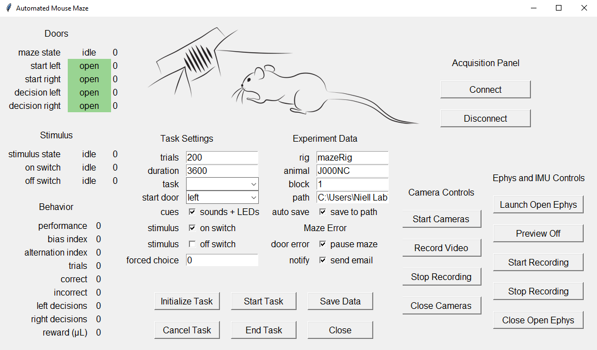

# automatedMouseMaze (under development)

GUI for behavioral and neurophysiological experiments in an automated maze for in mice  
Currently under development in the Niell Lab (https://nielllab.uoregon.edu/)

***Important: this app is currently under development***

***Disclamimer: the initial designs for this automated maze were based on experiments currently done in the Sylwestrak Lab*** (https://www.sylwestraklab.com/)

# Installation

### Requirements:
1. Operating System: Windows
2. Anaconda (https://www.anaconda.com/)

### Step by step:
In the Command Prompt:
1. Create your environment. Example:  
``conda create -n "automatedMouseMaze" python=3.10.14 pip``
2. Choose a location where you would like to copy this repo. Example:  
``cd C:\Users\<yourUser>\Documents\automatedMouseMaze\Application\``
3. Clone this repository:  
``git clone https://github.com/luismfranco/automatedMouseMaze.git``
4. Install dependencies in your environment:  
``pip install .``
5. This code was developed for Python - Teensy 4.0 communication. pyfirmata was developed for Arduino. There is bug in pyfirmata when trying to input the Teensy 4.0 layout. To fix it, run:  
``python src\debugPyFirmata.py`` 

If everything went well, you should be able to run the GUI:  
``python automatedMouseMaze.py``

However, this app requires a connection with a Teensy 4.0 board in order to work. Also, the automated maze has several other components, such as IR sensors, solenoid valves, a speaker, and LEDs. To build your own maze, follow this tutorial:  
[maze construction](docs/howToBuildYourOwnMaze.md)

# How to run this app
In the Command Prompt, activate your environment. Example:  
``conda activate automatedMouseMaze``
Then, cd to the location where this app was installed, and then type:  
``python automatedMouseMaze.py``

You could also create a batch file. Example:  
``call activate automatedMouseMaze``  
``cd C:\Users\Niell Lab\Documents\automatedMouseMaze\Application\``  
``python automatedMouseMaze.py``  

# Prepare your experiment
Describe entry fields...

# Run an experiment
Initialize connection...
Start experiment...
Save data...

# What's in the data pickle file?
Describe data fields...

